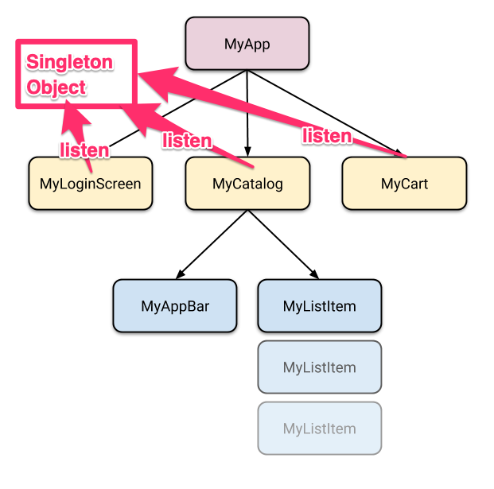
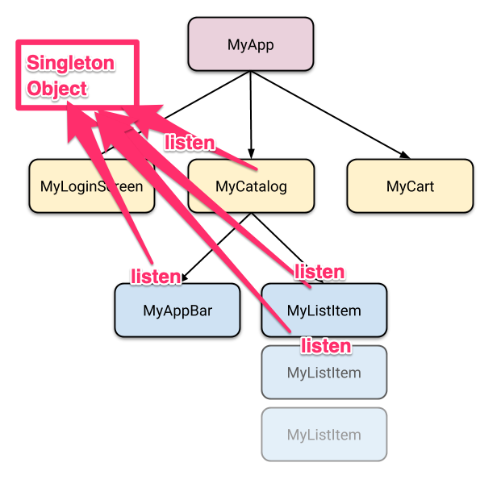

今天聽說了人家的 Flutter 的 app 架構，還是忍不去去嘴了一下，畢竟同樣的問題，在去年剛開始寫 Flutter 的時候也犯過，感覺很像是之前有過其他框架開發經驗之後，來寫 Flutter 很有可能會遇到的問題。

這個架構大概像是這樣：在我們的 App 中，需要從某個服務更新狀態，有多個不同的 Widget 都會參考到這些狀態。所以我們把段邏輯寫成了一個 singleton object，這個 singleton object 提供一個 broadcasting stream，所有需要參考資料的 widget，都去監聽這個 stream。一個這樣的 singleton 可能像這樣：

``` dart
class MySingleton {
  static var _shardInstance;

  static MySingleton shared() {
    if (_shardInstance == null) _shardInstance = MySingleton();
    return _shardInstance;
  }

  var _myController = StreamController.broadcast();

  Stream get myStream => _myController.stream;

  MySingleton() {
    anotherStream.listen((inComingData) {
      var outGoingData = process(inComingData);
      _myController.add(outGoingData);
    });
  }
}
```

至於 Widget 這端，則可能像是這樣：

``` dart
class MyWidget extends StatefulWidget {
  MyWidget({Key key}) : super(key: key);

  @override
  _MyWidgetState createState() => _MyWidgetState();
}

class _MyWidgetState extends State<MyWidget> {
  StreamSubscription _subscription;

  @override
  void initState() {
    super.initState();
    _subscription = MySingleton.shared().myStream.listen((incomingData) {
      setState(() {
        // .....
      });
    });
  }

  @override
  void dispose() {
    _subscription.cancel();
    super.dispose();
  }

  @override
  Widget build(BuildContext context) {
    return MyChild();
  }
}
```

如果我們把物件之間的關係畫成一張圖，大概像這樣。Flutter 當中，所有的 Widget 都會放在同一個樹狀結構當中，我們在這樣的樹狀結構之外，又多了一個對某個 singleton object 監聽的關係：



這樣寫會有什麼問題呢？因為同樣的架構，你也很有可能會產生下面這種物件關係：



如果你允許任一 Widget 都可以直接監聽某個 stream 的話，這就代表，在整顆 Widget Tree 裡頭的每個節點，都可以直接建立觀察的關係。但另一方面，在這個樹狀結構中，如果某一個 Widget 發生變動的時候，這個 Widget 都會繼續往下更新下方的節點狀態。所以，當你的物件是這種關係，而假設 MyCatalog 這個 Widget 不會在 build 的時候換掉底下的 children，那麼，就可以看到，這種架構會產生多餘的更新通知，綠色是 MyCatalog 去更新下方的 Widget，藍色則是下方 Widget 直接從 singleton object 的 stream 收到的通知：


另外，如果 MyCatalog 在遇到發生變動的時候，選擇的實作是把底下的 children 都換掉，那麼，讓 MyAppBar、MyListItem 去監聽 singleton object 更是沒有意義，因為在他們收到 stream 傳來的消息、應該要更新狀態的時候，這些 Widget 都已經被移出 Widget Tree 了，然後我們有建立一批 Widget，再去監聽 stream…。

那，我們可以約束團隊，只有某一層的 Widget 可以去監聽那個 singleton object 的 stream，不就沒這個問題了？可是，隨著匴體規模與團隊變大，當你的架構設計成每一層都有能力去監聽那個 stream，就遲早大家都搞步清楚在哪一層可以去監聽 stream，也遲早有人會寫出這種程式出來。

比較推薦的作法還是單純使用 Widget Tree 的更新機制，我們可以把這個 singleton object 的邏輯包裝在一個 [InheritedWidget](https://api.flutter.dev/flutter/widgets/InheritedWidget-class.html) 當中，或是 [Provider](https://github.com/rrousselGit/provider) 或 [bloc](https://pub.dev/packages/bloc) 裡頭，放在 Widget Tree 的上層，在資料變動時，透過往下 build 更新整個 UI 的狀態。
